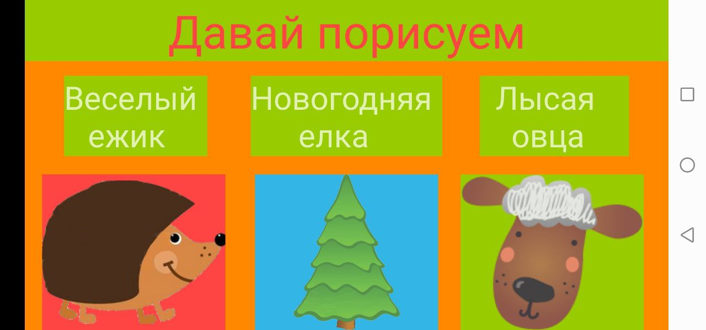
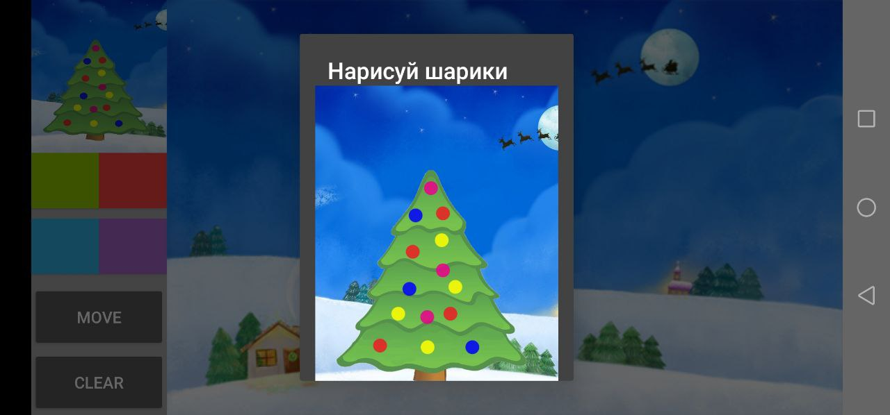
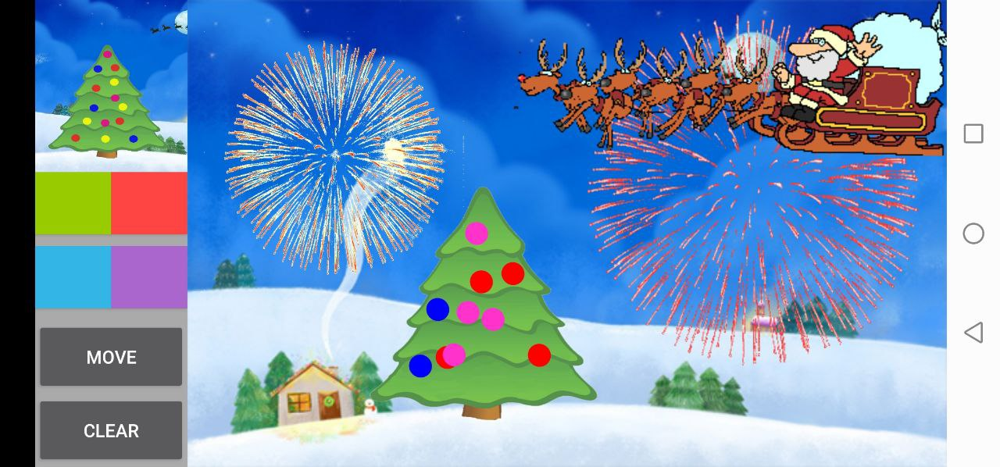
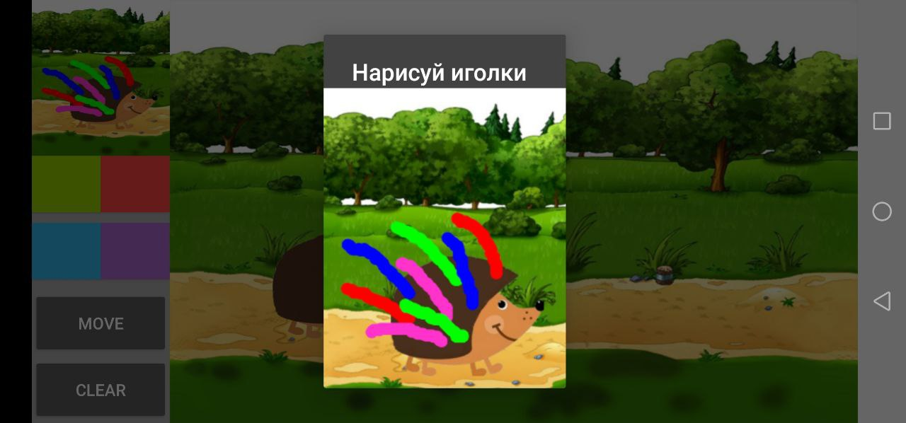
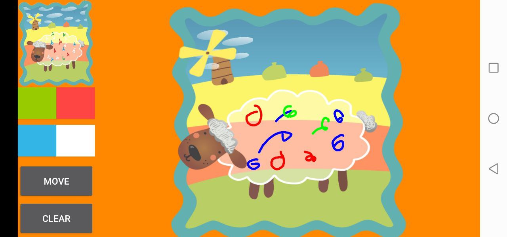

# DrowAnimals
A simple canvas for drawing for kids. Take a brush and draw animals. Use different colors. Choose an animal. Look at the preview picture and draw a similar one. If it is correct, the picture will come to life (animals will start moving, it will snow or fireworks and Santa Claus appeared in the sky). Try it now!!!

    
    
    
    
    

